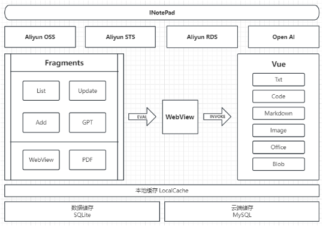

# Inotepad

Lightweight mobile file preview and editing tool. Supports common text types, and additionally provides preview support for language files, md, zip, pdf, pictures and other types. You can also use the built-in chtgpt service to analyze document content!

## Architecture

## Preview

